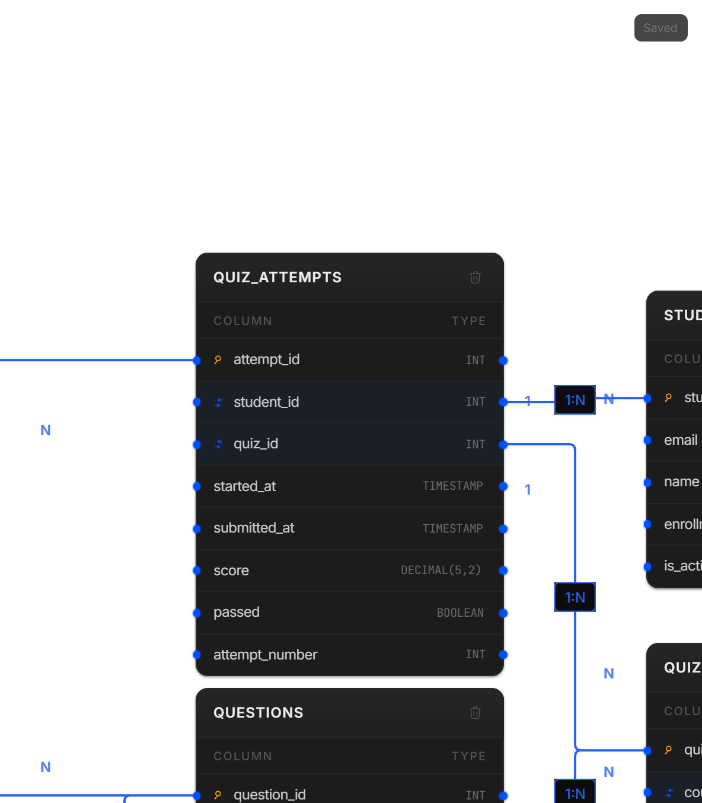

# 🎓 Online Quiz / Exam System

> A scalable relational data model for managing courses, quizzes, questions, student attempts, responses, scoring, and performance analytics.

---

## 📌 Problem Statement

Design a database for an online learning platform such as **Coursera or Google Learning** that can manage quiz content, student attempts, responses, scoring, and performance analytics.

The system should support multiple question types, preserve complete attempt history, and provide a foundation for real-time reporting and large-scale analytics.

---

## 🎯 Business Requirements

The system should answer key business questions such as:

- 📊 What is the average score for a specific quiz?
- ❓ Which questions have the lowest pass rate?
- 🎓 How many students passed a course?
- ⏱️ What is the time-to-complete distribution for each quiz?
- 🚨 Which students need remedial help?
- 🏆 Which students are performing best?
- 📈 How does student performance change across attempts?

---

## ⚙️ System Requirements

| Requirement | Scale |
|---|---:|
| 👨‍🎓 Students | 1M+ |
| 📚 Courses | 10K+ |
| 📝 Quizzes | 100K+ |
| ⚡ Concurrent Attempts | 100K attempts/hour |
| 🗃️ Historical Data | 2 years |
| 📊 Reporting | Real-time |
| 🏆 Leaderboards | Real-time |

---

# 🏗️ Data Model



The model consists of **7 core entities**:

| Table | Purpose |
|---|---|
| `STUDENTS` | Stores student information |
| `COURSES` | Stores course information and passing criteria |
| `QUIZZES` | Stores quizzes associated with courses |
| `QUESTIONS` | Stores questions belonging to quizzes |
| `ANSWER_CHOICES` | Stores answer options for questions |
| `QUIZ_ATTEMPTS` | Tracks every student attempt |
| `STUDENT_RESPONSES` | Stores individual question responses |

---

# 🔗 Entity Relationships

```text
                         ┌───────────────┐
                         │   STUDENTS    │
                         └───────┬───────┘
                                 │
                                1:N
                                 │
                                 ▼
                         ┌───────────────┐
                         │ QUIZ_ATTEMPTS │
                         └───────┬───────┘
                                 │
                                1:N
                                 │
                                 ▼
                         ┌──────────────────┐
                         │ STUDENT_RESPONSES│
                         └────────┬─────────┘
                                  │
                         ┌────────┴─────────┐
                         │                  │
                        N:1                N:1
                         │                  │
                         ▼                  ▼
                  ┌────────────┐    ┌───────────────┐
                  │ QUESTIONS  │    │ ANSWER_CHOICES│
                  └─────┬──────┘    └───────────────┘
                        │
                       N:1
                        │
                        ▼
                  ┌────────────┐
                  │  QUIZZES   │
                  └─────┬──────┘
                        │
                       N:1
                        │
                        ▼
                  ┌────────────┐
                  │  COURSES   │
                  └────────────┘
